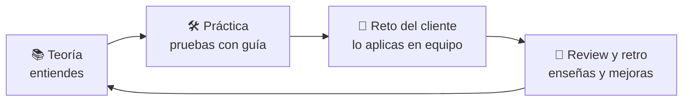
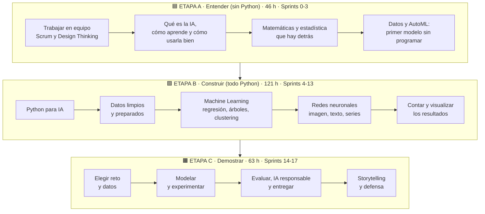
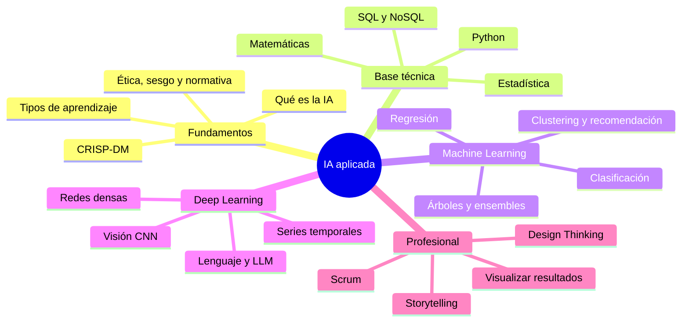
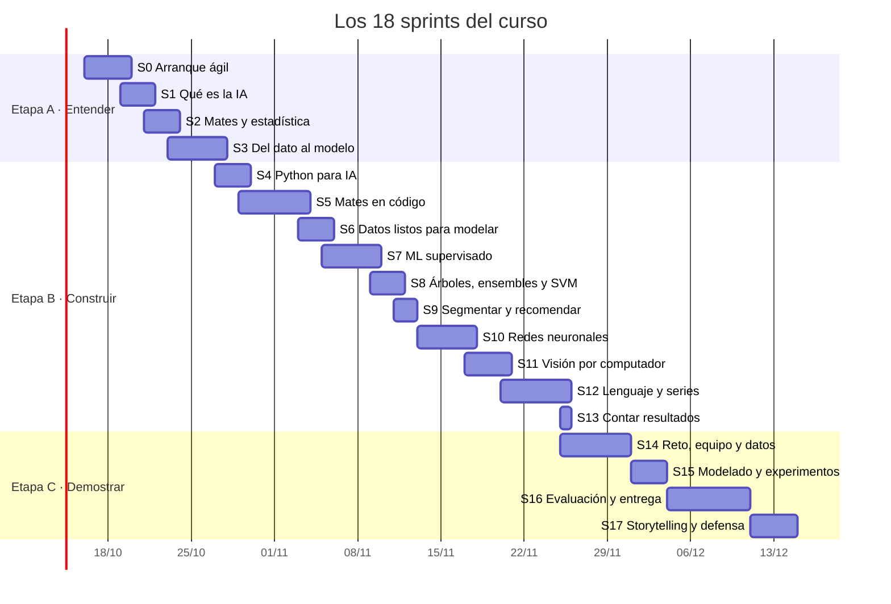
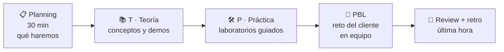
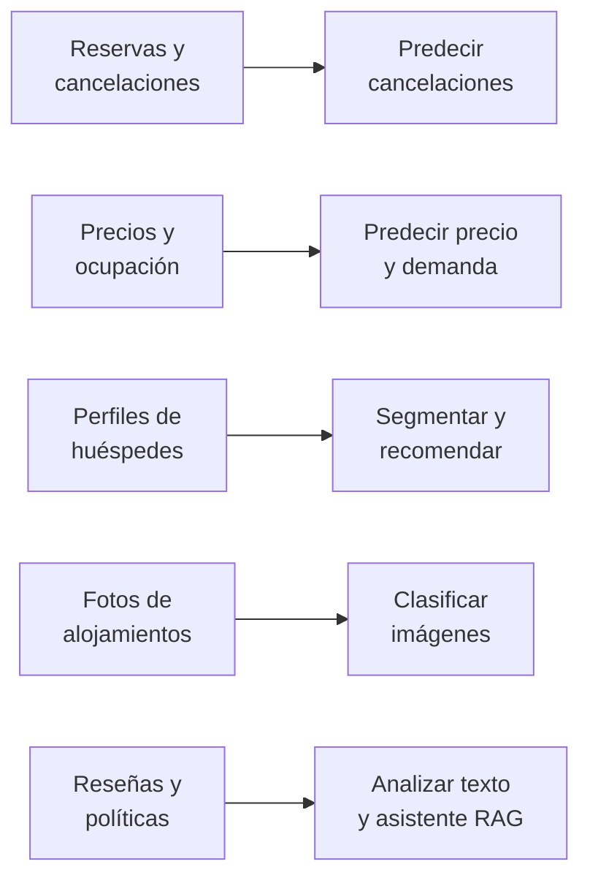
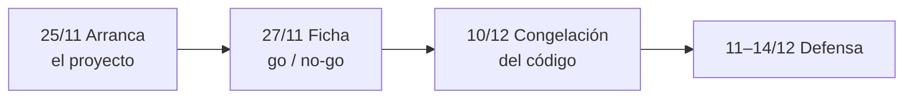

# 🧠 IFCD107 · Especialista en Inteligencia Artificial

> **230 horas · 16 de octubre – 14 de diciembre de 2026 · de 08:30 a 14:30**
> Acción 25-38/012242 · Servicio Canario de Empleo

Este documento es tu **mapa del curso**. En 10 minutos sabrás qué vamos a hacer, en qué orden, cómo se trabaja y cómo se evalúa.

## 🚀 Empieza aquí (5 pasos)

| Paso | Qué haces | Dónde |
|---|---|---|
| **1** | Entiende cómo funciona el curso | [`material/00_Como_funciona_el_curso.pdf`](material/00_Como_funciona_el_curso.pdf) |
| **2** | Crea tu cuenta de GitHub (si no tienes) | [`material/01_Primeros_pasos_con_GitHub.pdf`](material/01_Primeros_pasos_con_GitHub.pdf) |
| **3** | Tus dos primeros días, hora a hora | [`material/guia_primeros_dos_dias.md`](material/2.%20Guia_primeros_dos_dias.md) |
| **4** | Sigue tu ruta, sprint a sprint | [`material/mi_ruta_del_curso.md`](material/1.%20Mi_ruta_del_curso.md) |
| **5** | Consulta qué toca cada día | [`material/guia_dia_a_dia.md`](material/3.%20Guia_dia_a_dia.md) |

**No necesitas instalar nada ni saber programar.** Todo se hace desde el navegador. Más abajo tienes el mapa completo del curso, para cuando quieras el detalle.

**Índice del mapa:** [1. La idea en una frase](#1-la-idea-en-una-frase) · [2. El viaje completo](#2-el-viaje-completo) · [3. Calendario](#3-calendario-de-un-vistazo) · [4. Cómo es un sprint](#4-cómo-es-un-sprint) · [5. Los 18 sprints](#5-los-18-sprints) · [6. El cliente](#6-el-cliente-turisdata-canarias) · [7. El proyecto final](#7-el-proyecto-final) · [8. Evaluación](#8-cómo-se-evalúa) · [9. Herramientas](#9-herramientas) · [10. Este repositorio](#10-cómo-usar-este-repositorio)

---

## 1. La idea en una frase

**No vas a "ver" inteligencia artificial: vas a trabajar como consultor de IA para un cliente real (ficticio) durante 39 sesiones.**

Cada equipo de 3–4 personas es una **consultora**. Cada semana el cliente plantea un problema, aprendes lo necesario para resolverlo y entregas algo que funciona. Al final, cada equipo defiende un proyecto completo.

---

## 2. El viaje completo

El curso tiene **tres etapas**. La primera no usa Python: primero entiendes qué es la IA y cómo trabajar. La segunda es el bloque técnico. La tercera es tu proyecto.

### Qué aprenderás, en un mapa

### Las horas, por módulo

| Etapa | Módulo | Horas | Para qué sirve |
|---|---|---|---|
| 🟦 A | **M1a** Fundamentos de IA | 20 | Entender qué es y qué no es la IA |
| 🟦 A | **M6a** Bases de datos SQL/NoSQL | 4 | Guardar y consultar datos |
| 🟦 A | **M7** Auto Machine Learning | 10 | Primer modelo sin programar |
| 🟦 A | **M8** IA responsable | 5 | Usarla con criterio ético y legal |
| 🟦 A | **Softskills** Scrum + Design Thinking | 7 | Trabajar en equipo |
| 🟩 B | **M1b** Python + mates aplicadas | 22 | Tu herramienta de trabajo |
| 🟩 B | **M6b** CRUD desde Python | 1 | Conectar Python con datos |
| 🟩 B | **M2** Exploración de datos | 5 | Conocer y limpiar el dato |
| 🟩 B | **M3** Machine Learning | 40 | Los algoritmos clásicos |
| 🟩 B | **M4** Redes neuronales | 50 | Imagen, texto, series y LLM |
| 🟩 B | **M5** Visualización de resultados | 3 | Contar lo que hace el modelo |
| 🟧 C | **M9** Caso práctico (proyecto) | 60 | Tu proyecto final |
| 🟧 C | **Softskills** Storytelling | 3 | Defender tu trabajo |

Detalle completo, unidad por unidad, en [`material/temario.md`](material/temario.md).

---

## 3. Calendario de un vistazo

**Días sin clase:** 2/11, 7/12 y 8/12. **Última sesión:** 14/12, solo 2 h (defensas finales). Calendario con horas exactas: [`material/calendario_sprints.md`](material/calendario_sprints.md).

---

## 4. Cómo es un sprint

Un sprint dura entre 1 y 6 días lectivos. Todos tienen la misma forma:

| Tipo de hora | Qué haces | Cómo lo hacemos |
|---|---|---|
| **T · Teoría** | Entiendes el concepto | Presentación, demostraciones, ejemplos |
| **P · Práctica** | Lo pruebas con guía | Notebooks, solo o en parejas |
| **PBL** | Resuelves un reto del cliente | En equipo, con entregable |

**Rituales de cada sesión**
- **Daily (10 min)** al empezar: qué hice, qué haré, qué me bloquea.
- **Review (5 min por equipo)** al cerrar el sprint: enseñas tu entregable.
- **Retrospectiva:** qué mantenemos y qué cambiamos.
- **Roles rotativos:** cada sprint cambia quién es *Scrum Master* y quién es responsable técnico.

**Definition of Done (vale para todos los retos):** entregable reproducible (notebook o documento) + README + subido a Git + autoevaluación y coevaluación rellenadas.

---

## 5. Los 18 sprints

Cada sprint responde a **una pregunta del cliente** y termina en **un reto**.

### 🟦 Etapa A · Entender

| # | Fechas | Pregunta del cliente | Reto que entregas |
|---|---|---|---|
| **0** | 16–19/10 | ¿Cómo vamos a trabajar y con quién? | Constituir la consultora |
| **1** | 19–21/10 | ¿Dónde puede ayudar la IA y qué riesgos tiene? | Auditoría de oportunidades de IA |
| **2** | 21–23/10 | ¿En qué se apoyan los modelos y cuándo no fiarnos de un dato? | ¿Nos fiamos de este informe? |
| **3** | 23–27/10 | ¿Podemos tener un primer modelo funcionando sin programar? | Primer modelo en producción |

### 🟩 Etapa B · Construir

| # | Fechas | Pregunta del cliente | Reto que entregas |
|---|---|---|---|
| **4** | 27–29/10 | ¿Cómo automatizamos lo que hicimos a mano? | Herramientas internas |
| **5** | 29/10–3/11 | ¿Podemos demostrar con código lo que vimos en teoría? | ¿La ocupación depende de esto? |
| **6** | 3–5/11 | ¿Están los datos en condiciones de entrenar algo fiable? | Datos sucios, cliente impaciente |
| **7** | 5–9/11 | ¿Podemos predecir el precio o la cancelación? | Precio y cancelación |
| **8** | 9–11/11 | ¿Cuál es el mejor modelo y cuánto cuesta mantenerlo? | Duelo de modelos |
| **9** | 11–12/11 | ¿Qué tipos de cliente tenemos y qué les ofrecemos? | Conocer al huésped |
| **10** | 13–17/11 | ¿Una red neuronal mejora al ML clásico y a qué precio? | ¿Vale la pena la red? |
| **11** | 17–20/11 | ¿Podemos aprovechar las imágenes del cliente? | Visión artificial para el cliente |
| **12** | 20–25/11 | ¿Qué dicen los clientes y qué pasará mañana? | Escuchar al cliente |
| **13** | 25/11 | ¿Cómo enseñamos y defendemos los resultados? | Informe visual para dirección |

### 🟧 Etapa C · Demostrar (proyecto final)

| # | Fechas | Foco | Entregable |
|---|---|---|---|
| **14** | 25–30/11 | Reto, equipo y datos | Ficha de proyecto (antes del 27/11) |
| **15** | 1–3/12 | Modelado y experimentos | Baseline y modelos comparados |
| **16** | 4–10/12 | Evaluación, IA responsable y entrega | Demostrador + memoria técnica |
| **17** | 11 y 14/12 | Storytelling, ensayos y defensa | Defensa ante el tribunal |

---

## 6. El cliente: TurisData Canarias

Durante todo el curso trabajas para **TurisData Canarias**, una empresa **ficticia** de alojamiento y experiencias turísticas que quiere incorporar IA. Sus datos y problemas son inventados, pero realistas.

Cada reto añade una pieza. Al llegar al proyecto final ya habrás resuelto problemas de datos, modelos clásicos, imagen y texto.

---

## 7. El proyecto final

Los últimos **18 días lectivos** (25/11 – 14/12) son para un proyecto de equipo. Eliges entre **cuatro briefs** o propones uno libre:

| Brief | Tipo de problema |
|---|---|
| 1 · Demanda turística | Previsión de llegada de visitantes por isla y mes (series temporales) |
| 2 · Cultivos | Clasificación de imágenes con CNN y *transfer learning* |
| 3 · Orientación de FP | Asistente con LLM y RAG que cita sus fuentes |
| 4 · Demanda eléctrica | Series temporales e integración de renovables |

**Qué debe tener tu proyecto (resumen):** problema con métricas de éxito · datos con fuente y licencia · baseline + al menos 3 modelos · una red neuronal (o RAG) · gráficos de evaluación · análisis ético y de riesgo · demostrador ejecutable · repositorio Git reproducible · evidencia Scrum · memoria técnica · defensa de **todo** el equipo.

Toda la información en [`proyecto-final/briefs_y_rubrica.md`](proyecto-final/briefs_y_rubrica.md).

---

## 8. Cómo se evalúa

El resultado final es **Apto / No Apto**. Se evalúa con cuatro instrumentos:

| Instrumento | Cuándo | Peso orientativo |
|---|---|---|
| Tests de conocimientos | Al cierre de M1a, M3, M4 y del bloque M6–M8 | **30 %** |
| Ejercicios y entregas prácticas | Continua (cada reto) | **30 %** |
| Participación y trabajo en equipo | Continua y en el proyecto | **10 %** |
| Proyecto final: entrega + defensa | 11–14/12 | **30 %** |

- La **evaluación inicial** de la primera sesión no puntúa: sirve para saber desde dónde partimos.
- Para ser *Apto* hay que superar cada instrumento con **al menos el 50 %** y cumplir la asistencia mínima de la acción.
- Los pesos y umbrales son orientativos y se confirmarán con los requisitos oficiales.

---

## 9. Herramientas

| Herramienta | Para qué |
|---|---|
| **Google Colab / Jupyter** | Escribir y ejecutar código |
| **Python 3.11+** | Lenguaje principal |
| **Git y GitHub** | Guardar y compartir el trabajo del equipo |
| **Trello (o similar)** | Tablero Scrum |
| **VS Code** | Editor de código |

Todo lo que usamos tiene un nivel gratuito. **Nunca subas datos personales ni claves a un repositorio.**

---

## 10. Cómo usar este repositorio

| Carpeta | Qué encontrarás |
|---|---|
| [`material/`](material) | **Mi ruta del curso**, cómo funciona el curso, primeros pasos con GitHub, plantilla del repo de equipo, calendario y temario |
| [`sprints/`](sprints) | **Todo lo de cada sprint en su carpeta**: guía (README y PDF), presentaciones, notebooks y plantillas del reto |
| [`datos/`](datos) | Datos sintéticos de TurisData Canarias |
| [`proyecto-final/`](proyecto-final) | Briefs, requisitos y rúbrica |
| [`entregas/`](entregas) | Cómo entrega tu equipo y la tabla con el repositorio de cada equipo |

**Consejos para sacarle partido**
1. Antes de cada sprint, abre su carpeta en [`sprints/`](sprints) (empieza por el `README.md`) y lee su sección en [`material/calendario_sprints.md`](material/calendario_sprints.md). Para seguir el curso día a día, descarga y abre [`material/calendario_sprints.html`](material/calendario_sprints.html): marca el sprint en curso con la fecha de tu dispositivo.
2. Tras cada sesión, revisa el notebook del laboratorio y vuelve a ejecutarlo tú.
3. Trabaja el reto con tu equipo desde el primer día del sprint, no el último.
4. Haz commits a menudo: todos los integrantes deben aparecer en el historial.
5. Si algo no funciona, abre un *issue* o pregunta en clase.

*Las soluciones no se publican.*
